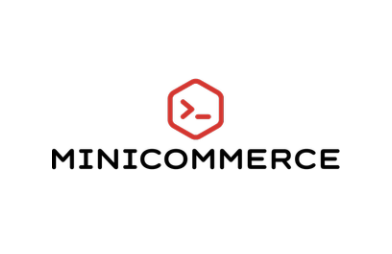

<div id="top"></div>

[![LinkedIn][linkedin-shield]][linkedin-url]


<!-- PROJECT LOGO -->
<br />
<div align="center">
  <a href="https://github.com/ardhyanth/miniCommerce">
    
  </a>

  <h3 align="center">MiniCommerce</h3>

  <p align="center">
    MiniCommerce is a node.js based web service that using Elevenia API implementation under the hood
    <br />
   
  </p>
</div>

<!-- GETTING STARTED -->
## Getting Started

This is  how you may setting up your project locally. To get a local copy up and running follow these simple example steps.

### Installation

Below is how to installing and setting up the service. 

1. Get a free API Key at [(http://soffice.elevenia.co.id/login.do).]((http://soffice.elevenia.co.id/login.do).)
2. Clone the repo
   ```sh
   git clone https://github.com/ardhyanth/miniCommerce.git
   ```
3. Install NPM packages
   ```sh
   npm install
   ```
4. Enter your API in `.env`
   ```js
   const ELEVENIA_KEY = 'ENTER YOUR API';
   ```
5. For the DDL, you can see `DDL.sql` in project root. This is necessary to be executed due to the usage of trigger function that helps recalculating some field used in this project.

<p align="right">(<a href="#top">back to top</a>)</p>


<!-- USAGE EXAMPLES -->
## Usage

#### Running development mode. 
Currently for development purpose only.
```bash
npm run dev
```
after a bit of time, you will see this log on the terminal
```bash
Server running on http://localhost:3000
```
and the server is ready for next development/trial

#### Running test
```bash
npm run test
```

<p align="right">(<a href="#top">back to top</a>)</p>

## API Documentation

For the API documentation, we are using swagger with the integration of Joi and Hapi.js. 
You can access more detailed documentation of the API on `/docs`, after the service is running.


<!-- ROADMAP -->
## Roadmap

- [x] Add Swagger
- [x] Add core functionality
- [x] Add endpoint proxy to Elevenia
- [x] Add unit test
- [ ] Restructure code hierarchy
- [ ] add more unit test and complete coverate

See the [open issues](https://github.com/othneildrew/Best-README-Template/issues) for a full list of proposed features (and known issues).

<p align="right">(<a href="#top">back to top</a>)</p>


<!-- CONTRIBUTING -->
## Contributing

Contributions are what make the open source community such an amazing place to learn, inspire, and create. Any contributions you make are **greatly appreciated**.

If you have a suggestion that would make this better, please fork the repo and create a pull request. You can also simply open an issue with the tag "enhancement".
Don't forget to give the project a star! Thanks again!

1. Fork the Project
2. Create your Feature Branch (`git checkout -b feature/AmazingFeature`)
3. Commit your Changes (`git commit -m 'Add some AmazingFeature'`)
4. Push to the Branch (`git push origin feature/AmazingFeature`)
5. Open a Pull Request

<p align="right">(<a href="#top">back to top</a>)</p>


<!-- LICENSE -->
## License

Distributed under the MIT License.

<p align="right">(<a href="#top">back to top</a>)</p>


<!-- MARKDOWN LINKS & IMAGES -->
<!-- https://www.markdownguide.org/basic-syntax/#reference-style-links -->
[linkedin-shield]: https://img.shields.io/badge/-LinkedIn-black.svg?style=for-the-badge&logo=linkedin&colorB=555
[linkedin-url]: https://www.linkedin.com/in/rahmadani-ardhyanto-a20649132/
